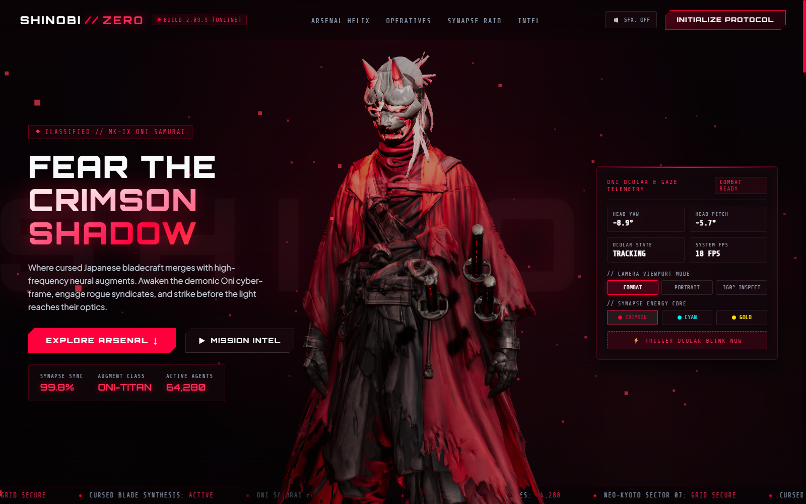
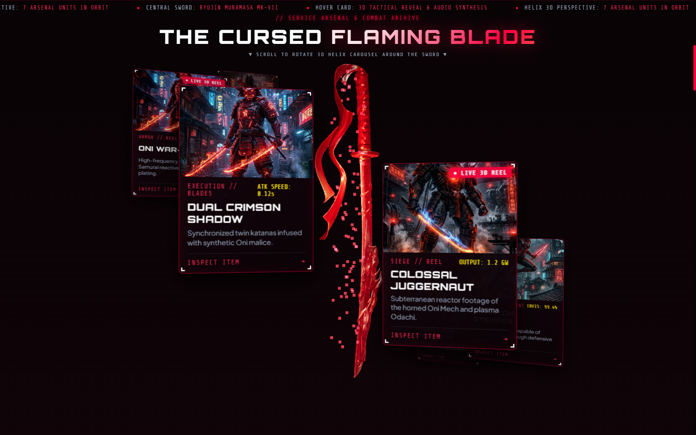
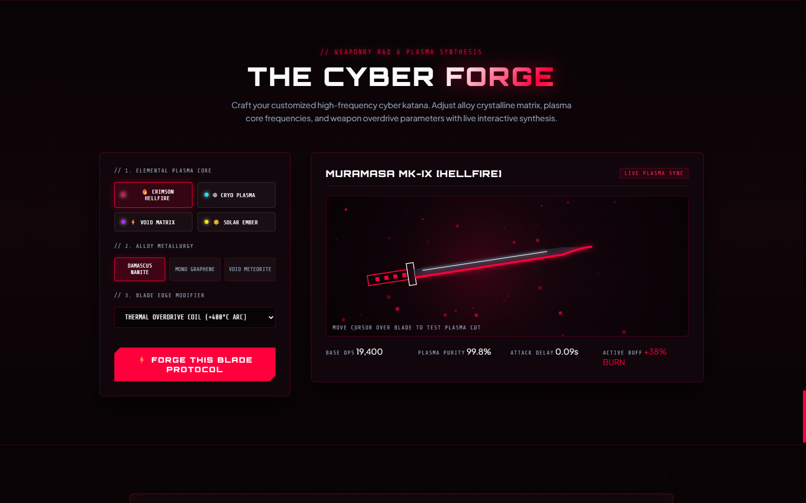
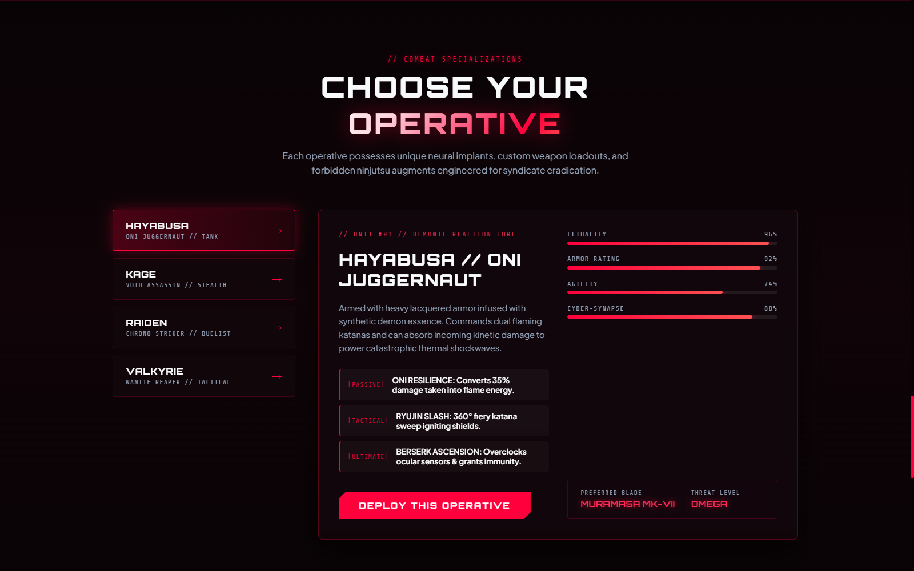

# ⚔️ Cyber-Oni Samurai // Next-Gen 3D Gaming Landing Page

<div align="center">

[](https://threejs.org/)
[](https://vitejs.dev/)
[](https://developer.mozilla.org/)
[](https://www.w3.org/TR/css-transforms-2/)
[](https://developer.mozilla.org/en-US/docs/Web/API/Web_Audio_API)

**Высокотехнологичный интерактивный игровой веб-лендинг в стилистике Cyberpunk / Dark Anime с 3D-трекингом взгляда и спиральной галереей арсенала.**

[🌐 Репозиторий на GitHub](https://github.com/LazizYT/first_project) • [⚡ Демо / Локальный запуск](#-установка-и-быстрый-старт)

</div>

---

## 📸 Галерея и скриншоты проекта

### 1. Главный экран: 3D Кибер-Они Самурай и тактический HUD
> *Интерактивный 3D-самурай в реальном времени следит за курсором мыши, реагирует на клики и синхронизирован с тактической телеметрией.*

<div align="center">
  
</div>

- **Инверсивный трекинг взгляда**: расчет углов рыскания (Yaw) и тангажа (Pitch) для естественного поворота головы и плечевого пояса.
- **Тактический HUD**: живые показатели градусов, статус моргания оптических сенсоров, счетчик системного FPS.
- **Динамический переключатель палитр**: мгновенная смена 4 неоновых стилей (*Crimson Malice*, *Void Cyan*, *Toxic Acid*, *Imperial Gold*) с изменением Three.js источников света и эмиссионных материалов.
- **Процедурный аудио-синтезатор**: звуки сервоприводов, плазмы и кликов, генерируемые на лету через `Web Audio API`.

---

### 2. Секция «Arsenal Helix»: Спиральная 3D-галерея вокруг огненного меча
> *Карточки проектов и вооружения вращаются по 3D-орбите вокруг вонзенного вертикального клинка Мурамаса, двигаясь по траектории слева-сверху направо-вниз.*

<div align="center">
  
</div>

- **Центральный 3D-клинок**: трехмерный меч с шейдерным плазменным свечением и вихрем искр.
- **7 арсенальных юнитов в орбите**: 3 зацикленных видео-демонстрации (`.mp4`) и 4 детализированных концепт-арта со стеклянным неоновым эффектом.
- **Плавная физика скролла**: алгоритм с интерполяцией движения (`lerp damping`), амфитеатральным наклоном карточек и динамическим масштабированием.
- **Высокая производительность**: отключение воспроизведения скрытых видео и ленивая отрисовка Three.js через `IntersectionObserver`.

---

### 3. Интерактивная кибер-кузница (The Cyber Forge)
> *Лаборатория синтеза клинков с живым физическим холстом Canvas 2D и частицами высокотемпературной плазмы.*

<div align="center">
  
</div>

- Выбор плазменного ядра (*Crimson Hellfire*, *Cryo Plasma*, *Void Matrix*, *Solar Ember*).
- Выбор металлургии сплава и модификаторов кромки лезвия.
- Интерактивный тест клинка движением курсора с генерацией тепловых искр и расчетом DPS.

---

### 4. Досье оперативников (Choose Your Operative)
> *Интерактивный терминал выбора боевых классов ниндзя синдиката.*

<div align="center">
  
</div>

- Интерактивные профили бойцов (*Hayabusa*, *Kage*, *Raiden*, *Valkyrie*).
- Анимированные шкалы характеристик (Lethality, Armor Rating, Agility, Cyber-Synapse).
- Карточки уникальных пассивных, тактических и ультимативных способностей.

---

## 🛠 Технологический стек

| Технология | Назначение |
|---|---|
| **Three.js** | 3D-рендеринг персонажа, меча, освещения, теней и частиц |
| **Vite** | Модульная сборка и HMR разработка со сверхбыстрым откликом |
| **CSS 3D Transforms** | Аппаратно-ускоренные 3D-карточки со стеклянным градиентом |
| **Web Audio API** | Процедурный синтез футуристических звуковых эффектов |
| **IntersectionObserver** | Изоляция рендеринга внеэкранных 3D-сцен для стабильных 60–120 FPS |
| **HTML5 Canvas 2D** | Высокопроизводительная симуляция частиц в Кибер-Кузнице |

---

## 💻 Установка и быстрый старт

### Требования:
- [Node.js](https://nodejs.org/) (версии 18 или новее)
- Git

### 1. Клонирование репозитория
```bash
git clone https://github.com/LazizYT/first_project.git
cd first_project
```

### 2. Установка зависимостей
```bash
npm install
```

### 3. Запуск сервера разработки
```bash
npm run dev
```
После запуска откройте в браузере **`http://localhost:3000/`**.

### 4. Сборка для продакшена
```bash
npm run build
```
Собранные оптимизированные файлы появятся в директории `dist/`.

---

## 📁 Структура проекта

```
first_project/
├── docs/
│   └── images/              # Скриншоты и превью для документации
├── public/
│   ├── images/              # Текстуры и арты карточек (card_1..7)
│   ├── videos/              # Зацикленные видео-ролики карточек (video_1..3)
│   ├── flaming-sword.glb    # 3D-модель пылающего клинка
│   └── oni-samurai.glb      # 3D-модель Они-Самурая
├── src/
│   ├── audio.js             # Синтезатор звуков Web Audio API
│   ├── main.js              # Инициализация приложения, observer'ы и кузница
│   ├── ninjaModel.js        # Управление Three.js моделью и трекингом глаз
│   ├── scene.js             # Главная Three.js сцена самурая
│   ├── spiralGallery.js     # 3D-спираль карточек и орбитальная математика
│   ├── styles.css           # Полная стилизация, анимации, HUD и адаптив
│   └── swordScene.js        # Three.js сцена вертикального огненного меча
├── index.html               # Разметка всех игровых секций
├── package.json
└── README.md
```

---

<div align="center">
  <sub>Создано с использованием передовых веб-технологий и Three.js. Репозиторий: <a href="https://github.com/LazizYT/first_project">LazizYT/first_project</a></sub>
</div>
